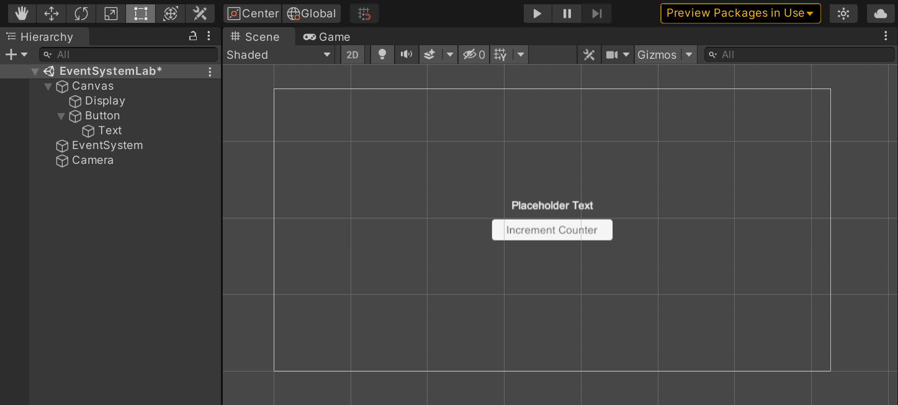

# Event System Lab
- [Event System Lab](#event-system-lab)
- [Summary](#summary)
- [Setup](#setup)
- [Part 1: Creating A Basic Interface](#part-1-creating-a-basic-interface)
  - [UI](#ui)
  - [Creating The Event](#creating-the-event)
  - [Listening For The Event](#listening-for-the-event)
  - [Sending The Event](#sending-the-event)
  - [Testing The Event](#testing-the-event)
- [Part 2: Adding A Cache](#part-2-adding-a-cache)
- [Conclusion](#conclusion)

# Summary

Welcome to this lab on creating and calling basic events using the Arsis Event System.
In this lab, you will learn about the fundamental design principles and data flow of events in Arsis.
By the end of the lab, you will have created a simple button that increments a 
counter when pressed, and a cache that stores the counter value between restarts.

This lab should take about `30` minutes to complete.

# Setup
Before you begin, make sure that the branch of the repository you are working on has the lab files. 
If you are not sure, there should be the following files in the `Assets/Labs/EventSystem` folder:
```
- Example
    - ...
- EventSystem.md
- IntStore.cs
```

# Part 1: Creating A Basic Interface
## UI
Before we set up the backend events, lets create a simple UI to display the outputs so we can see them in action.
1. Create a new empty scene for this lab and open it. We can do this by selecting `File > New Scene` from the Unity Editor menu
2. We will need to add a text display and a button to the scene. 
   - To create the text and basic canvas add a Text gameobject to the scene `GameObject > UI > Text` 
   - To create the button right click the Canvas in he hirarchy and add a Button gameobject `UI > Button`
     - You can change the text on the button by changing the text on the child Text gameobject

Now the scene should look like this:



*Note: The new input system may cause errors when the scene is run. If that happens select the event system and click the `Replace with InputSystemUIInputModule` button.*

## Creating The Event
Now that we have a UI to display the output, lets create the event that will increment the counter.
To create a new event type, we need to create a new class that inherits from `BaseArsisEvent`.
1. Create a new C# script in the `Assets/ARSIS/Core/EventManager/EventTypes` folder called `CounterValue.cs` and open it in your editor. Events are stored in the `EventTypes` folder regardless of the type of event or what system uses it.
2. We will need to import the `EventSystem` namespace to use the `BaseArsisEvent` class. Then we will need to define a class with the properties that we want. In this case, the minimal event would be
```csharp
using EventSystem;

public class CounterValue : BaseArsisEvent {
    public int value;
}
```
Although this is perfesctly valid, we can add some quality of life features to make it easier to use. Events are wrappers around data. They can have any type of property, private or public, and can have any number of them. Event types are checked at compile time, so every event listener will know what properties are available and what type they are and can use them without having to check for null *(**unless the event data values are nullable**)* or type errors.
```csharp
using EventSystem;

public class CounterValue : BaseArsisEvent {
    public int value;

    public CounterValue(int value) {
        this.value = value;
    }

    // This allows us to use the CounterValue class as an int
    public static implicit operator int(CounterValue e) {
        return e.value;
    }

    public override string ToString() {
        return value.ToString();
    }
}
```
Now we have a basic event that can be used to set the counter value. We need to create the script that will listen for the event and update the UI and the script that will send the event when the button is pressed.

## Listening For The Event
1. Create a new MonoBeheiviour and open it in your editor.
2. Import the `EventSystem` and `UnityEngine.UI` namespaces.
3. Define a class with a method that sets the text of the UI to the value of a `CounterValue` event. This method might look like this:
```csharp
void UpdateCounterValue(CounterValue v)
{
    // counterText is a reference to the Text component of the UI Text GameObject
    counterText.text = v.ToString(); 
}
```
4. Add the `OnEnable` and `OnDisable` methods to the class. These methods are called when the script is enabled and disabled. We will use them to register and unregister the event listener.
```csharp
void OnEnable()
{
    EventManager.AddListener<CounterValue>(UpdateCounterValue);
}
void OnDisable()
{
    EventManager.RemoveListener<CounterValue>(UpdateCounterValue);
}
```
5. Add the script to the Text GameObject in the scene and set the `counterText` variable to the Text component.

## Sending The Event
1. Create a new MonoBeheiviour and open it in your editor.
2. import the `EventSystem` namespace.
3. add a event listener to the button's `onClick` event that increments the value of an int and sends the new value in a `CounterValue` event. That method might look like this:
```csharp
using UnityEngine;
using EventSystem;
using UnityEngine.UI;

public class CounterUpdater : MonoBehaviour {
    public int val = 0;
    public Button button;
    private void Start() {
        button.onClick.AddListener(() => EventManager.Trigger(new CounterValue(++val)));
    }
}
```
4. Add the script to the Button GameObject in the scene and set the `button` variable to the Button component.

## Testing The Event
Now that we have created the event and the scripts to listen for and send it, we can test it out.
When the scene is runnnig, the counter should increment when the button is pressed and the UI should update to display the new value.
Although this seems like a lot of complexity for incrementing the value in a text field, we can now also add additional buttons and displays *(`Ctrl+D` to duplicate)* and the event will still work as expected without manualy referencing the other objects, using `Find` or `GetComponent` to get a reference to them, or having to write additional code (managers) to update the other objects.

# Part 2: Adding A Cache
Because we are using events, we can easily add a cache to make the counter value persist between restarts. We just need to add a script that listens for the `CounterValue` event and stores the value in a cache. Then the same script can emit a `CounterValue` event when the scene is loaded to set the counter to the cached value. This code might look like this:
```csharp
using EventSystem;
using UnityEngine;

public class CounterCache : MonoBehaviour {
    void OnCounterUpdate(CounterValue value) {
        IntStore.value = value;
    }

    private void Start() {
        EventManager.Trigger(new CounterValue(IntStore.value));
    }
}
```
With that code added, we will need to update the `CounterUpdater` script to allow the initilization of the counter value to be set from the cache. We can do this by adding an event listener for the `CounterValue` event in the `Awake` method. The updated code might look like this:
```csharp
using UnityEngine;
using EventSystem;
using UnityEngine.UI;

public class CounterUpdater : MonoBehaviour {
    public int val = 0;
    public Button button;
    private void Start() {
        button.onClick.AddListener(() => EventManager.Trigger(new CounterValue(++val)));
    }

    private void Awake() {
        EventManager.AddListener<CounterValue>(OnCounterUpdate);
    }

    void OnCounterUpdate(CounterValue value) {
        val = value;
    }
}
```

Now when the scene is run, the counter increments and retains its value between restarts. You can clear the value of the cache by the `DemoCache/Clear` menu item in the Unity Editor.

# Conclusion

