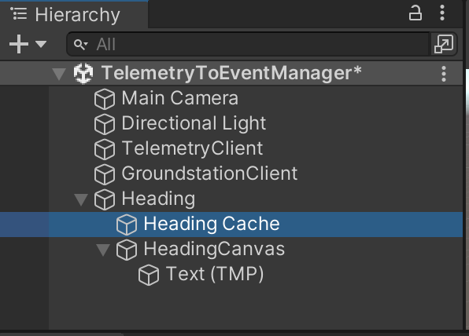
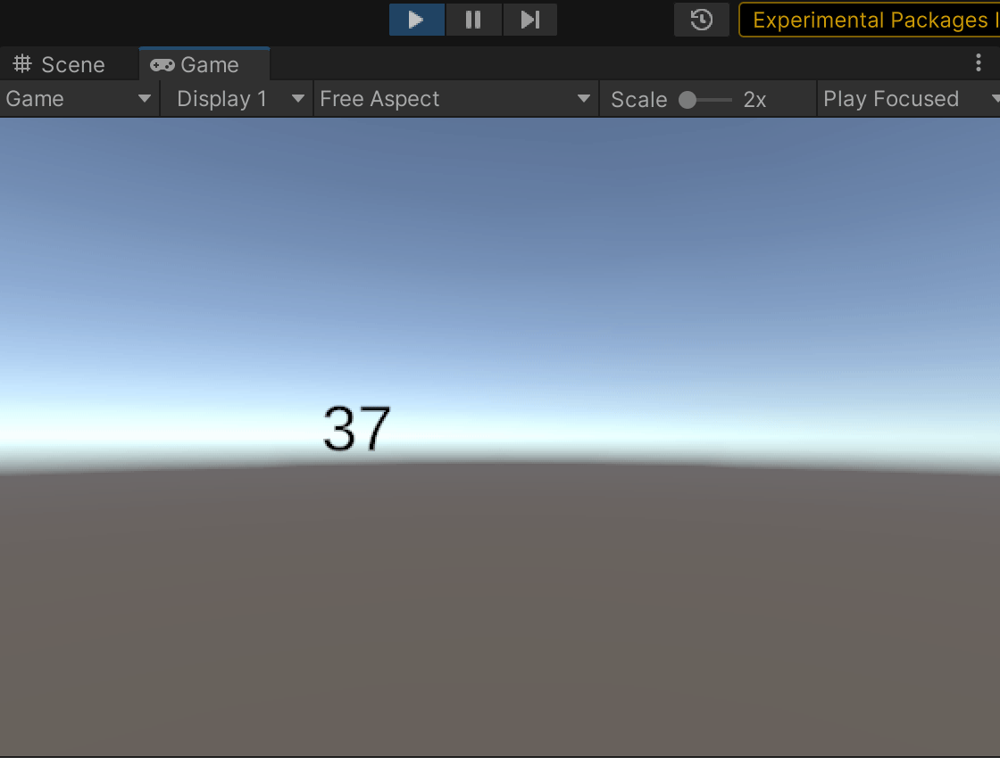

# Creating a heading api endpoint

This won't show the actual heading because we do not have the hardware to show a magnetometer reading yet. So, instead we're showing the that the heading will increment for each request to the API.

## Step 0: Ensure your environment is working

This assumes that you've followed the setup have your fork and github set correctly and that we're reading to start a new branch to work on a feature.

If so go to your repo and type in  `git checkout -b <my-feature>` dont include brackets and replace that with whatever the name of your branch is. A good habit that I try to do but forget more often than I care to admit is to prefix your branch with the issue number you're working on. Once you do this type in `git status` and you can see you're on your branch

## Step 1: Create a get endpoint

Open `ARSIS-Telemetry-GroundControl/telemetry-api/app/main.py` and add the following to the top of the file.

```
app.mock_heading = 0.0
```

Later add the actual endpoint.

```
@app.get("/heading/")
async def getHeading():
    app.mock_heading += 1
    app.mock_heading %= 360
    return {"heading": app.mock_heading}
```

Here we can see we're adding an endpoint for the end of the server url with "/heading/" Then we're incrementing the value (so we can see it change) and mod it to 0-360 like most compasses are.

Our return is very important and needs to match what we make next. It is a json response with a single key heading and then a number as the value.

To test our endpoint go to `ARSIS-Telemetry-GroundControl/` and type `docker compose up` or `docker-compose up` depending on if you're using the plugin to docker (1st option) or stand alone script(2nd option).

Open a browser to `http://0.0.0.0:8080/docs` (8080 is telemetry, 8181 is ground control)

This is the landing page.


Clicking to the endpoint we just created


Clicking on try it out and then execture (because it doesnt have anything to call the api with)


Keep clicking the execute button to see that the heading increments every time.

## Step 2: Create event

Create a file under `/ARSIS-Unity/Assets/ARSIS/Core/EventManager/EventTypes/Telemetry/` called "HeadingEvent.cs"

In this we put the following
```
using EventSystem;

public class HeadingEvent : BaseArsisEvent
{
    public readonly float heading;

    public HeadingEvent(float heading)
    {
        this.heading = heading;
    }
}
```

This is what we will populate our response into. Notice that the key for this is also heading.

## Step 3: Add our polling to the `TelemetryClient.cs`

We need to modify `ARSIS-Unity/Assets/ARSIS/Networking/Telemetry/TelemetryClient.cs` (My branch has some extra modifications so you can either copy paste what Biometrics and Location do or modify it so its the new way we're doing this.

```
using System.Collections;
using System.Collections.Generic;
using UnityEngine;
using EventSystem;
using UnityEngine.Networking;
using Newtonsoft.Json;

public class TelemetryClient : MonoBehaviour
{
    private static string telemetryServerUrl = "http://localhost:8080";
    private static string telemetryServerLocation = telemetryServerUrl + "/location/";
    private static string telemetryServerBiometrics = telemetryServerUrl + "/biometrics/";
    private static string telemetryServerHeading = telemetryServerUrl + "/heading/";
    // We create a timer outside of the loop to make sure we're not creating and then GCing constantly
    private WaitForSeconds telemetryPollingDelay = new WaitForSeconds(1.0f);

    // Start is called before the first frame update
    void Start()
    {
        // Start all of our polling when this starts
        StartCoroutine(StartPollingTelemetryApi());
    }

    // Update is called once per frame
    void Update()
    {

    }

    IEnumerator StartPollingTelemetryApi() {
        //Start each one as its own coroutine
        StartCoroutine(StartPollingEvent<HeadingEvent>(telemetryServerHeading, telemetryPollingDelay));
        StartCoroutine(StartPollingEvent<LocationEvent>(telemetryServerLocation, telemetryPollingDelay));
        StartCoroutine(StartPollingEvent<BiometricsEvent>(telemetryServerBiometrics, telemetryPollingDelay));
        yield break;
    }

    //Generic way to creating a polling event using the type of event to be triggered when it gets a sucessful request.
    //TODO: Add more robust handling of faults.
    IEnumerator StartPollingEvent<E>(string url, WaitForSeconds tpd){
        while(true){
            UnityWebRequest www = UnityWebRequest.Get(url);
            yield return www.SendWebRequest();

            if (www.result != UnityWebRequest.Result.Success) {
                Debug.Log(www.error);
            }
            else {
                string resultString = www.downloadHandler.text;
                /* Debug.Log(resultString); */
                E newEvent = JsonConvert.DeserializeObject<E>(resultString);
                EventManager.Trigger(newEvent);

            }
            yield return telemetryPollingDelay;
        }
    }
}
```

## Step 4: Create something to listen to event.

Here it gets a bit dicey. With my understanding of Unity Singletons its not generally bad to use them if they are generally immutable or have a limited scope, so I am making the Heading Cache A sington. It could also be a component and it would have to be slecected throught something like `GetComponent`.

Here is an example of the `HeadingCache.cs` class

```
using System.Collections;
using System.Collections.Generic;
using UnityEngine;
using EventSystem;

public class HeadingCache : MonoBehaviour
{

    public HeadingEvent headingEvent;
    public static HeadingCache HeadingCacheSingleton { get; private set; }
    private void Awake()
    {
        // If there is an instance, and it's not me, delete myself.

        if (HeadingCacheSingleton != null && HeadingCacheSingleton != this)
        {
            Destroy(this);
            EventManager.RemoveListener<HeadingEvent>(UpdateHeading);
        }
        else
        {
            HeadingCacheSingleton = this;
            EventManager.AddListener<HeadingEvent>(UpdateHeading);
        }
    }

    // Update is called once per frame
    void Update()
    {

    }

    void UpdateHeading(HeadingEvent he){
        headingEvent = he;
    }

    public string getHeadingString(){
        return headingEvent.heading.ToString();
    }
}
```

I am not sure if this is the best way to do it so comments are, like always, more than welcome and appreciated.

## Step 5 Display the heading

Here I make something incredibly janky to show the heading being updated. Its so bad. I apologize in advance.



I created an empty game object for the feature named heading then 2 children game objects one for the cache and one for the canvas and then added a TMP Text game object. On the cache game object I added the script from above and on the TMP Text I added the following script.

```
using System.Collections;
using System.Collections.Generic;
using UnityEngine;
using TMPro;


public class HeadingUpdater : MonoBehaviour
{
    HeadingCache headingCache;
    TMP_Text text;
    // Start is called before the first frame update
    void Start()
    {
        headingCache = HeadingCache.HeadingCacheSingleton;
        text = GetComponent<TMP_Text>();
        Debug.Log(headingCache);
    }

    // Update is called once per frame
    void Update()
    {
        text.text = headingCache.getHeadingString();
    }
}
```

## Check that its working in Unity

Run the unity scene and see that it is working


